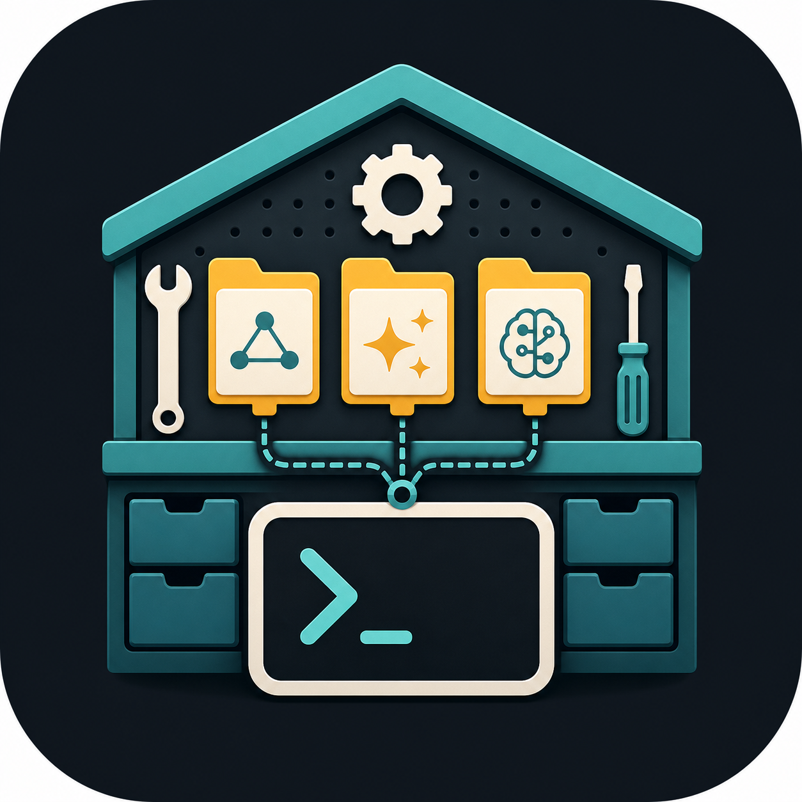

<p align="center">
  
</p>

<h1 align="center">skillyard</h1>

<p align="center">
  
  
  
</p>

<p align="center"><strong>Manage global agent skills without losing track of where they came from.</strong></p>

`skillyard` is a small Go CLI for installing and updating Agent Skills from local folders, public GitHub repositories, and private Git repositories. It keeps an explicit lockfile of sources, subscriptions, commits, snapshots, and symlinks so global skill installs stay inspectable and reversible.

It is designed for the workflow where a skill might live in a dedicated skills collection like `github:lox/agent-skills`, or inside an application repo like `github:lox/slack-cli` at `skills/slack`.

## Install

From the latest published GitHub release:

```bash
mise use -g github:lox/skillyard
```

That installs `skillyard` globally and puts it on your `PATH` through mise shims.
It requires a published release; use the local checkout path below before the first release exists.

From a local checkout during development:

```bash
mise run install
```

That builds `skillyard` into:

```text
~/bin/skillyard
```

## Quick start

Create the default config:

```bash
skillyard setup
```

Preview installing a public application repo's bundled skill:

```bash
skillyard subscribe github:lox/slack-cli --dry-run
```

Inspect a source without changing subscriptions, links, or the lockfile:

```bash
skillyard discover github:lox/slack-cli
```

Show a skill's instructions without installing it:

```bash
skillyard show github:lox/agent-skills --include check-pr-description
```

Install it for every enabled configured agent:

```bash
skillyard subscribe github:lox/slack-cli
```

Subscribe to a full skills collection:

```bash
skillyard subscribe github:lox/agent-skills --include '*'
```

Inspect everything `skillyard` manages, plus unmanaged skills already present in your agent roots:

```bash
skillyard list
```

Update Git-backed subscriptions and reconcile links:

```bash
skillyard sync
```

## What it does

- reads skills from local paths, GitHub shorthand, HTTPS Git URLs, SSH Git URLs, and `file://` Git URLs
- tracks a Git branch, tag, or commit when `--ref` is set
- discovers skills at the source root, direct child directories, `skills/<name>`, `skills/<category>/<name>`, `.agents/skills/<name>`, `.claude/skills/<name>`, and plugin-declared skill paths
- inspects source skills, validation findings, and warnings without installing
- prints a selected skill's `SKILL.md` without installing it
- validates `SKILL.md` frontmatter before linking
- symlinks selected skills into configured agent skill directories
- stores Git installs as immutable snapshots under `~/.local/share/skillyard`
- keeps local path installs mutable for active development
- records ownership in `~/.config/skillyard/skillyard.lock.json`
- defaults omitted `--target` to all enabled configured agents
- defaults omitted `--include` to the only discovered skill when the source has exactly one
- refuses unmanaged conflicts unless `--force` is used for symlink replacement
- lists unmanaged files, directories, symlinks, and broken symlinks in agent skill roots

## Configuration

`skillyard setup` creates:

```text
~/.config/skillyard/config.hcl
```

When no config exists, `skillyard` uses built-in Codex and Amp targets:

```text
codex -> ${CODEX_HOME:-~/.codex}/skills
amp   -> ~/.config/agents/skills
```

The config file can override, disable, or add agent targets:

```hcl
agent "codex" {
  enabled    = true
  skills_dir = "$CODEX_HOME/skills"
}

agent "amp" {
  enabled    = true
  skills_dir = "~/.config/agents/skills"
}

agent "custom" {
  enabled    = true
  skills_dir = "~/custom-agent/skills"
}
```

`skills_dir` supports `~` and environment variable expansion.

If `--target` is omitted, `subscribe` installs to every enabled configured agent. Pass `--target` to narrow it:

```bash
skillyard subscribe github:lox/slack-cli --target codex
```

## Sources and selection

Dedicated skills repositories usually want an explicit broad subscription:

```bash
skillyard subscribe github:lox/agent-skills --include '*'
```

Application repositories usually want the bundled skill only. If the source has exactly one skill, the short form is enough:

```bash
skillyard subscribe github:lox/slack-cli
```

For multi-skill sources, be explicit:

```bash
skillyard subscribe ~/Develop/manager-os --include slack --include notion
```

Exclude a target-specific skill from a broad subscription:

```bash
skillyard subscribe github:lox/agent-skills \
  --include '*' \
  --exclude consulting-librarian \
  --target amp
```

## Commands

```bash
skillyard setup
skillyard setup --dry-run
skillyard setup --force

skillyard discover github:lox/slack-cli
skillyard discover github:lox/agent-skills --json
skillyard discover ./repo --full-depth
skillyard discover github:lox/agent-skills --ref v1.2.3

skillyard show github:lox/agent-skills --include check-pr-description
skillyard show github:lox/agent-skills --include check-pr-description --ref main
skillyard show ./skills/review

skillyard export --target codex > skillyard.lock.json
skillyard apply skillyard.lock.json --target codex --dry-run

skillyard subscribe github:lox/slack-cli --dry-run
skillyard subscribe github:lox/slack-cli
skillyard subscribe github:lox/agent-skills --include '*'
skillyard subscribe github:lox/agent-skills --include '*' --ref v1.2.3
skillyard subscribe git@github.com:org/private-skills.git --include deploy-review --target codex

skillyard list
skillyard list --json

skillyard sync
skillyard sync github:lox/agent-skills
skillyard sync --target amp
skillyard sync --dry-run

skillyard unsubscribe slack --target codex
skillyard unlink slack --target codex
skillyard doctor
```

### `discover`

Shows the skills available from a source without changing subscriptions, installed links, or the lockfile.

```bash
skillyard discover <source>
```

The output includes source type, resolved source root, skill paths, installability, validation findings, and warnings such as `scripts/`, executable files, or `mcp.json`.

```bash
skillyard discover github:lox/slack-cli
skillyard discover ~/Develop/lox-agent-skills --json
skillyard discover ./repo --full-depth
skillyard discover github:lox/agent-skills --ref v1.2.3
```

Use `--full-depth` when you want read-only inspection to find every nested `SKILL.md` under a source, not only the standard skill container layouts.

`skillyard` also reads `.claude-plugin/plugin.json`, `.claude-plugin/marketplace.json`, `.codex-plugin/plugin.json`, and `.codex-plugin/marketplace.json` when they declare explicit skill paths.

Use `--ref` with Git sources to inspect a branch, tag, or commit instead of the remote default branch.

### `show`

Prints one selected skill's `SKILL.md` content to stdout without changing subscriptions, installed links, or the lockfile.

```bash
skillyard show <source> [--include <skill>]
```

If the source has exactly one discovered skill, `--include` can be omitted. If the source has zero or multiple matching skills, `show` fails with guidance to select exactly one skill.

```bash
skillyard show github:lox/agent-skills --include check-pr-description
skillyard show github:lox/agent-skills --include check-pr-description --ref v1.2.3
skillyard show ./skills/review
```

Use `--ref` with Git sources to print instructions from a branch, tag, or commit without changing subscriptions.

### `subscribe`

Adds or updates a subscription, resolves matching skills, and links them unless `--dry-run` is set.

```bash
skillyard subscribe <source> [--include <pattern>] [--target <agent>]
```

Useful flags:

```text
--include <pattern>  include a skill name or glob; repeatable
--exclude <pattern>  exclude after includes; repeatable
--target <agent>     install into one configured agent; repeatable
--name <source-id>   override the generated source id
--ref <ref>          Git branch, tag, or commit to track
--force              replace unmanaged symlinks and drifted managed links
--dry-run            show the plan without changing links or lockfile
--json               emit machine-readable output
```

### `export` and `apply`

Use `export` to write portable desired state for sources and subscriptions. Realized installs, snapshot paths, checkout paths, and last-seen commits are omitted. Git refs are preserved.

```bash
skillyard export > skillyard.lock.json
skillyard export --target codex > skillyard.lock.json
```

Use `apply` to reconcile the current machine to an exported desired-state file.

```bash
skillyard apply skillyard.lock.json --dry-run
skillyard apply skillyard.lock.json --target codex
```

When `--target` is omitted, `apply` replaces all current subscriptions with the file's subscriptions. When `--target` is set, only that target's subscriptions are replaced; other targets are left alone.

### `list`

Shows subscriptions, managed installs, and unmanaged entries in configured skill roots.

```text
Subscriptions
TARGET  SOURCE                   INCLUDE  EXCLUDE
codex   github-com-lox-skills    *        -

Managed
SKILL       TARGET  SOURCE                   STATUS          PATH
slack       codex   github-com-lox-skills    linked          /Users/me/.codex/skills/slack

Unmanaged
SKILL       TARGET  KIND            PATH                                  LINK_TARGET
old-skill   codex   dir             /Users/me/.codex/skills/old-skill     -
local-dev   codex   symlink         /Users/me/.codex/skills/local-dev     /Users/me/Develop/app/skills/local-dev
```

Empty sections render as `none`. Unmanaged entries are useful because they are the things that can affect agent behavior or block a future install.

### `sync`

Refreshes Git sources, creates new snapshots, links newly matching skills, retargets managed links, and removes managed links that no longer match the subscription.

```bash
skillyard sync
```

When a Git source advances, the action output includes a `source-update` row with the previous and new commit. Skill retarget rows also include the commit they moved from and to, which makes `--dry-run` useful for reviewing updates before applying them.

If a subscription used `--include '*'`, newly added upstream skills are installed on sync unless excluded.

### `unsubscribe` vs `unlink`

Use `unsubscribe` to change desired state:

```bash
skillyard unsubscribe slack --target codex
```

Use `unlink` for repair/debugging when you want to remove the realized symlink but keep the subscription:

```bash
skillyard unlink slack --target codex
```

A later `sync` may recreate an unlinked skill if the subscription still matches it.

## Safety model

`skillyard` is conservative about target directories:

- non-symlink files and directories are never overwritten
- unmanaged symlinks are only replaced with `--force`
- managed symlinks are removed only when recorded in the lockfile
- Git installs link to immutable commit snapshots, not mutable branch checkouts
- local path installs are marked `mutable-source`
- failed preflight checks leave target links and lockfile state untouched

The lockfile lives at:

```text
~/.config/skillyard/skillyard.lock.json
```

Git source checkouts and snapshots live under:

```text
~/.local/share/skillyard/sources/
```

## Development

```bash
mise install
mise run install
go test ./...
go vet ./...
```

Use isolated XDG paths when smoke-testing commands that would otherwise touch your real skill roots:

```bash
tmp="$(mktemp -d)"
SKILLYARD_CONFIG_DIR="$tmp/config" \
SKILLYARD_DATA_DIR="$tmp/data" \
SKILLYARD_CACHE_DIR="$tmp/cache" \
CODEX_HOME="$tmp/codex-home" \
HOME="$tmp/home" \
  go run ./cmd/skillyard setup --dry-run
```

## Release flow

Releases follow the same GitHub release pattern as `lox/slack-cli`: a local mise task creates the next `v*` tag, then GitHub Actions runs GoReleaser for the published artifacts.

From an up-to-date `main` checkout:

```bash
git fetch --tags origin
git pull --ff-only
mise run release
```

`mise run release` runs `mise run check`, uses `svu` to choose the next semantic version from conventional commits, refuses to continue if no version bump is detected, creates the tag, and pushes it to `origin`.

The pushed tag triggers `.github/workflows/release.yml`. GoReleaser reads `.goreleaser.yml` and publishes Linux, macOS, and Windows archives for amd64 and arm64 plus `checksums.txt`.

After the release is published, verify the consumer install path:

```bash
mise use -g github:lox/skillyard
skillyard --version
```
